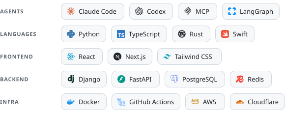

<picture>
  <source media="(prefers-color-scheme: dark)" srcset="./assets/signature-dark.svg">
  
</picture>

Agentic Developer · Fullstack Engineer · Photographer · Sydney

[misoto22.com](https://misoto22.com) · [LinkedIn](https://www.linkedin.com/in/henry-misoto22) · [Instagram](https://www.instagram.com/hry.photography) · [Email](mailto:henrycxw@gmail.com) · [Resume ↗](https://files.misoto22.com/resume.pdf)

 

I build with coding agents — and the harness that keeps them honest. My work sits where agents meet real repositories: rule contracts every agent reads, skills that turn a workflow into one command, and scheduled audit loops that land as reviewable pull requests. Underneath, I'm a fullstack engineer shipping React, Django, FastAPI and PostgreSQL on Docker and GitHub Actions. Open to **agentic engineering** and **fullstack** roles.

### Featured Work

**Agentic engineering**

- **[Touchstone](https://github.com/Misoto22/touchstone)** — Scheduled agent loops that audit a repository and turn findings into PR-only changes, run locally or in GitHub Actions. On PyPI as `touchstone-agent`. Python · LangGraph · SQLite · Codex CLI · Claude Code · GitHub Actions
- **[Skills](https://github.com/Misoto22/skills)** — 24 portable agent skills in 7 plugins for Claude Code, Codex and ~70 other agents: ship a PR end to end, clean up merged branches, polish a repository, draft policy-aware email. Agent Skills · Claude Code · Codex · Python
- **Kioku** — A personal memory API: PostgreSQL + pgvector with an incremental RAG pipeline, exposed to my agents as MCP tools behind database-enforced access roles. Python · FastAPI · PostgreSQL · pgvector · MCP

**Product engineering**

- **[misoto22.com](https://misoto22.com/projects/personal-website)** — Bilingual portfolio with an AI assistant grounded in the site's own content, agent-readable via `llms.txt` and OpenAPI, WCAG AAA contrast, self-hosted on Docker. Next.js 16 · TypeScript · PostgreSQL + pgvector · LiteLLM · Docker
- **[SlateCourt](https://misoto22.com/projects/slatecourt)** — Mobile-first PWA for Sydney badminton: 54 venues, live court availability read from venues' public booking pages, and a game ledger with bill-splitting. Next.js 16 · FastAPI · PostgreSQL · Redis · Cloudflare Workers
- **[Lumia Crystal](https://www.lumiacrystal.com)** — Headless storefront for a crystal jewellery brand, live in production: the Shopify Storefront API behind a 4-layer cache for sub-second page loads across 60+ products. Next.js 15 · TypeScript · Tailwind CSS 4 · Shopify GraphQL · Vercel

### Toolbox

<picture>
  <source media="(prefers-color-scheme: dark)" srcset="./assets/toolbox-dark.svg">
  
</picture>

 

<picture>
  <source media="(prefers-color-scheme: dark)" srcset="https://contribution.oooo.so/_/Misoto22?chart=3dbar&gap=2&scale=1.8&gradient=true&legend=true&legendPosition=bottomLeft&legendDirection=row&strokeWidth=2&strokeColor=003300&flatten=0&animation=wave&animation_duration=2&animation_delay=0.03&animation_amplitude=40&animation_frequency=0.2&animation_wave_center=0_6&weeks=36&theme=emerald_canopy&dark=true&format=svg">
  
</picture>

3D contribution chart by <a href="https://github.com/CatsJuice/ssr-contributions-img">ssr-contributions-img</a>, made by <a href="https://github.com/CatsJuice">@CatsJuice</a>

